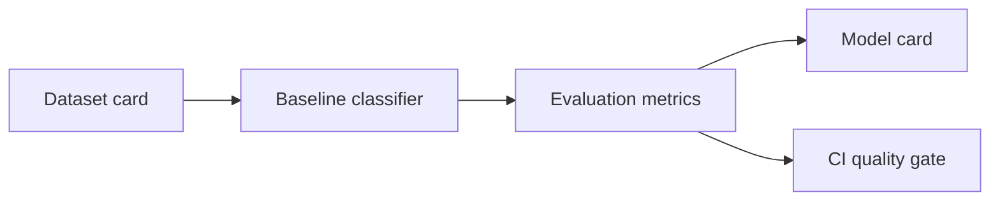

# LLM Fine-Tuning Eval Lab

> Legacy repository name: `LLM-Sarcasm-FineTuning-Gemma3`. This project now hosts the upgraded fine-tuning and evaluation workflow.

Reproducible fine-tuning and evaluation workflow for LLM classification tasks, upgraded from notebook-only experimentation into a reviewable engineering project.

The first task is sarcasm classification inspired by the original Gemma fine-tuning work. The repo keeps the baseline lightweight so CI can run without GPUs, while the docs explain how to extend it to full model fine-tuning.

## Architecture



## What This Demonstrates

- Clean separation between data, training/evaluation code and model documentation.
- Deterministic baseline metrics for CI.
- Dataset and model cards with limitations.
- Upgrade path from notebook experiments to production-aware ML workflow.

## Quick Start

```bash
python -m venv .venv
source .venv/bin/activate
pip install -e ".[dev]"
python -m llm_finetuning_eval_lab.evaluate
pytest
```

## Future Fine-Tuning Path

- Add LoRA/QLoRA training config for Gemma-family models.
- Track experiments with a lightweight registry.
- Add prompt-based and fine-tuned model comparisons.
- Add bias, robustness and calibration checks.

